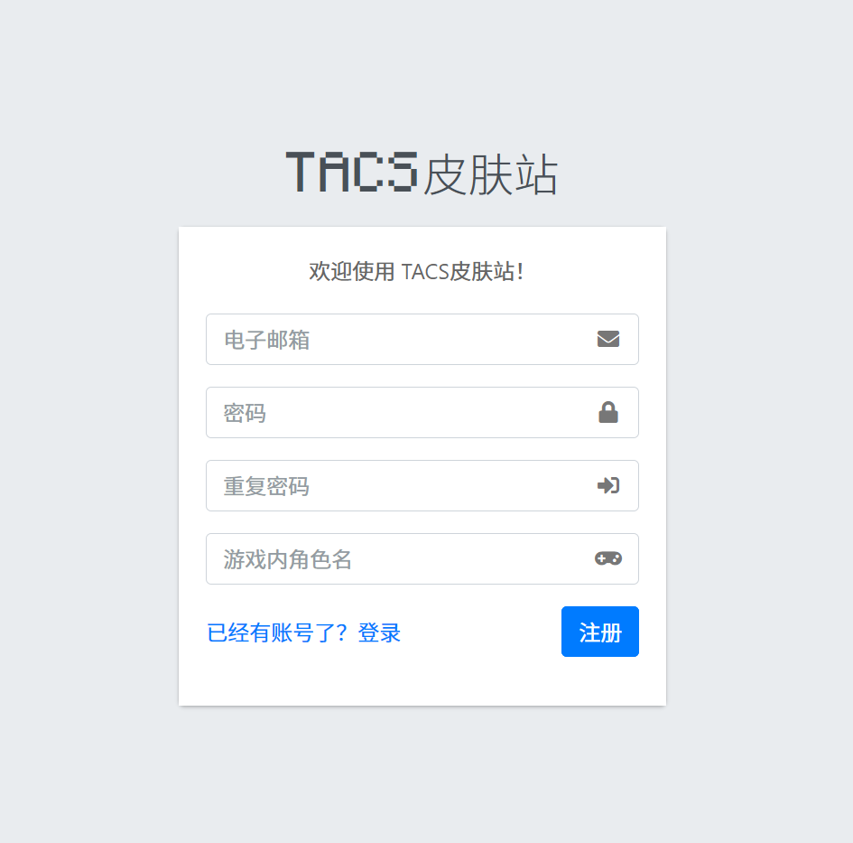
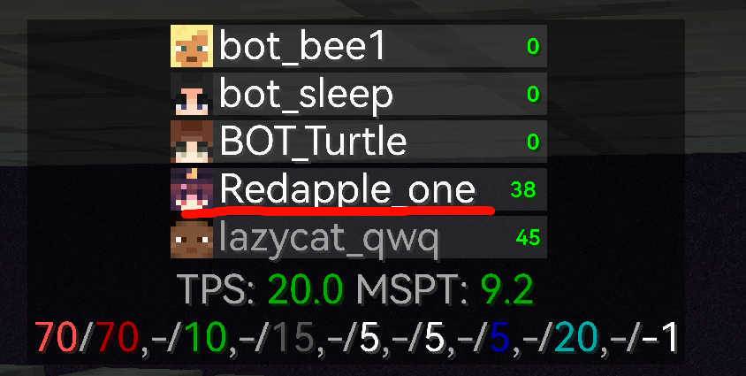
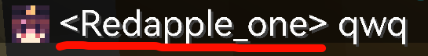
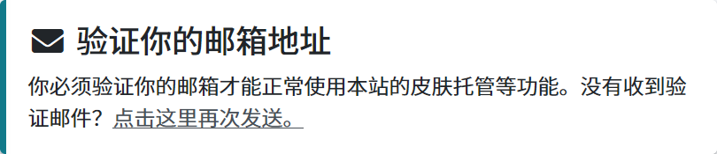
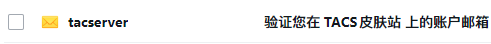
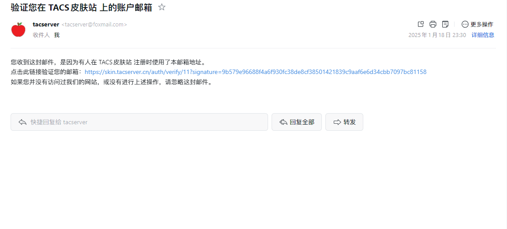
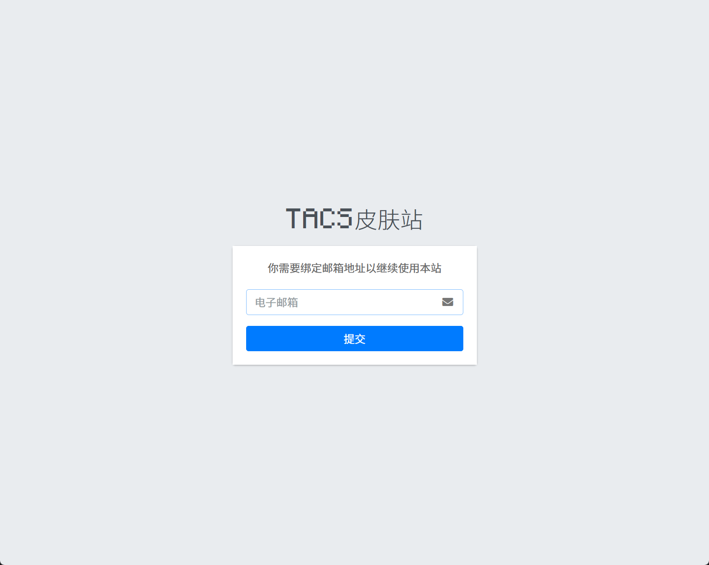

## 关于

[TACS 皮肤站](https://skin.tacserver.cn)基于 [Blessing Skin Server](https://github.com/bs-community/blessing-skin-server) 运行，支持 Yggdrasil API 第三方登录。

为了防止小号，目前仅支持 QQ 邮箱注册，每个账号仅允许拥有一个游戏内角色名。

> [!NOTE]
>
> 皮肤站通过 Cloudflare Tunnel 运行。
>
> 由于 Cloudflare 的环大陆 CDN，部分地区可访问性极低，故请使用特定网络访问此网站。

## 注册

前往[注册页面](https://skin.tacserver.cn/auth/register)，如果一切正常，你会看到以下页面：

填入所有信息后点击右下角的注册按钮，完成注册。

> [!NOTE]
> 什么是“游戏内角色名”？
>
> 游戏内角色名就是游戏内你所使用的 ID：
>
> 
>  
> 

> [!WARNING]
>
> 禁止恶意模仿其他玩家名字！
>
> 例如使用大写的`I`和小写的`l`：
>
> *Redapp**l**e_one*, *Redapp**I**e_one*

## 验证邮箱

注册成功后，来到仪表盘，你会看到一条通知：

你可能需要打开 [QQ 邮箱](https://mail.qq.com)并登录，查看收件箱或垃圾/骚扰邮件，寻找一封类似这样的邮件并打开：

打开后你会看到类似的邮件内容：

点击邮件中的链接，你会看到：

此时再次填写注册时填写的邮箱，点击“提交”按钮后即可完成邮箱验证。

## 在启动器内添加皮肤站登录方式

### PCL2

<video controls src="./assets/PCL2.mp4" title="PCL2"></video>

### HMCL

<video controls src="./assets/HMCL.mp4" title="HMCL"></video>

## 尾声

大功告成！现在你可以使用 TACS 皮肤站登录进入服务器了！

> [!NOTE]
>
> 如果你是根据开篇中的“对于无正版玩家”的提示来注册 TACS 皮肤站，  
> 请返回[开篇](./manual/beginning.md)并完成剩余操作。
