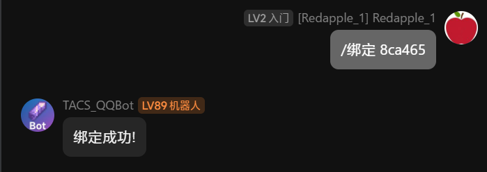
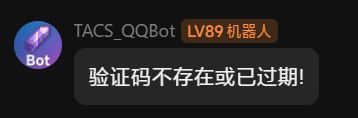

!!! warning "对于无正版玩家"
    **服务器不支持离线账号**
    
    请离线玩家先查阅[注册TACS皮肤站](../TACS_Skin.md#注册)文档, 获取你的TACS皮肤站账号, 注册完成后再返回此文章

当你通过 视频, 朋友推荐, 线下宣传, ~~服主托梦~~ 等方式听说到TACS的时候, 腐竹(Redapple_one)已经给你留下了简洁且快速的入服方式, 请往下看

## 加入玩家交流群
玩家交流群是服务器的消息中心, 从玩家聊天到服务器公告发布都在玩家交流群内进行

[加入玩家交流群](https://qm.qq.com/cgi-bin/qm/qr?k=nKByoLEzE8dgiiHM-zoZMMWZwfbRfUMG&jump_from=webapi&authKey=gKjazVdZQHz1tyIu6mL54gah90ammPM9cIr8UlYyAkLGYfkFRJFaAM5efzD8hcPV)
!!! info "入群要求"
    你需要满足以下两个要求的任意一种, 机器人才会自动通过你的入群申请

    - 被群内成员邀请入群
    - 入群问题的答案符合特定的关键词

## 在进入服务器之前
服务器支持两种入服方式: **[IPv4](https://baike.baidu.com/item/IPv4/422599)**&**[IPv6](https://baike.baidu.com/item/IPv6/172297)**

IPv4和IPv6的IP都会在群公告里面公布 **获取最新IP请查看群公告**

??? question "IPv4与IPv6的区别"
    IPv6为公网直接连接, 延迟最低, 但是有些玩家不支持该入服方式

    IPv4为内网穿透, 延迟比IPv6高

    **请尽量选择IPv6进服以获得最好的游玩体验**

## 获取白名单
### 获取绑定指令
使用你的账号<small>(TACS皮肤站账号, 正版账号)</small>进入服务器
> 视频内的服务器ip仅供参考 获取最新ip请查看群公告
<video controls src="../../assets/join_server.mp4" title="进入服务器"></video>

### 绑定账号
不出意外, 你将会看到以下画面

此时, 按照指示操作, 在群内发送你的绑定指令

!!! tip "请尽快进行绑定"
    绑定指令动态刷新, 获得绑定指令后请尽快进行绑定, 如机器人发送
    

    请重新进入服务器, 获取新绑定指令

## 进入服务器
至此, 你已经获得服务器白名单

**服务器的最新IP会发布在群公告内**

服务器版本为1.21.3, 可使用 1.21.4~1.9进入服务器

你可以使用原版客户端进入服务器(不推荐)

如果你想获得更好的游玩体验, 我们推荐[XPlus基础整合包](https://modrinth.com/modpack/xplus-2.0-modpack-global)
!!! warning "跨版本"
    对于非1.21.x版本的入服问题, 我们不提供支持

    如需获取最好的游玩体验, 请使用1.21.3进入服务器