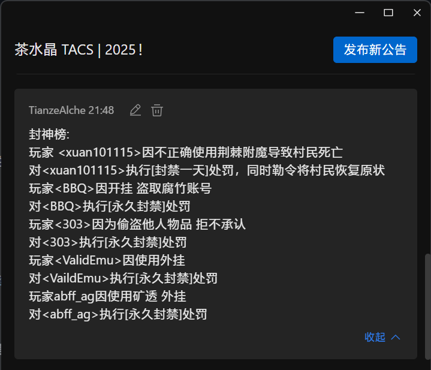

!!! tips "仅供参考"
    本条目目前还未制作完毕, 处罚制度不完善, 定义不准确
## 开挂者/黑客
### **定义**
在TACS中, 对开挂者/黑客的定义如下

- 未使用生电类(masa全家桶)模组实现非正常游戏行为(杀戮光环, 自动搭路)
- 未使用服务器提供的方式实现非正常游戏行为(杀戮光环, 自动搭路)
- 使用wurst/meteor等外挂客户端入服的(无论是否启用客户端内功能)
- 尝试盗取他人账号的
- 尝试爆破服务器后台和管理网页的
- 尝试破坏服务器内玩家系统的
- 给服务器大量发包占用服务器带宽的
- 尝试攻击服务器网站的

### **处罚**

情节轻微者, **封禁七天**

情节严重者, **永久封禁且不得再次入服**

## 偷盗者
> 本条仅受害者向管理报告后, 才处理
### **定义**
在TACS中, 对偷盗者的定义如下

- 未经他人允许拿取他人物品的
- 未经他人允许大量拿取(大于3组且超过总物品的85%)公共物品的
- 未经他人允许拿取分类机内填充物的
- 未经他人允许挖取他人房屋/机器内方块的

> 他人物品指玩家的一切个人资产, 包括但不限于物品, 房屋, 机器, 宠物, 作物

### **处罚**

情节轻微者, 归还赃物, **封禁一天**

情节严重且拒不归还者, **永久封禁且不得再次入服**

偷取分类机内填充物者, **永久封禁且不得再次入服**

## 破坏者
### **定义**

- 破坏服务器内基础设施的
- 破坏服务器内交通设施的
- 通过直接方式(挖取其方块)破坏他人机器的
- 通过间接方式(防火, 岩浆烫, TNT炸)破坏他人机器的
- 恶意破坏服务器未开发地形的
- 恶意破坏服务器内制度的
- 恶意破坏服务器内新玩家入服路线(新手礼包, 入服道路)的
- 恶意破坏服务器内地狱门的

### 处罚

责令恢复

情节严重者, **封禁三天**

## 言论不当者/刷屏者
### 定义

- 恶意在服务器语音频道内发表不当言论的
- 恶意在服务器群内发表不当言论的
- 恶意在服务器游戏内内发表不当言论的
- 在群内大量发送消息刷屏的
- 利用群内机器人刷屏的的
- 在游戏内大量发送消息刷屏的

> 不当言论指言语攻击他人或违反中国法律的言论

### 处罚

情节轻微者, **封禁半天**, **群内禁言一天**

情节严重者, **封禁一个月**, **群内禁言一个月**

## 公示处罚

封禁处罚会在 ~~封神榜~~ 群公告内展示

<small>2025年1月21日 21:54的封神榜</small>